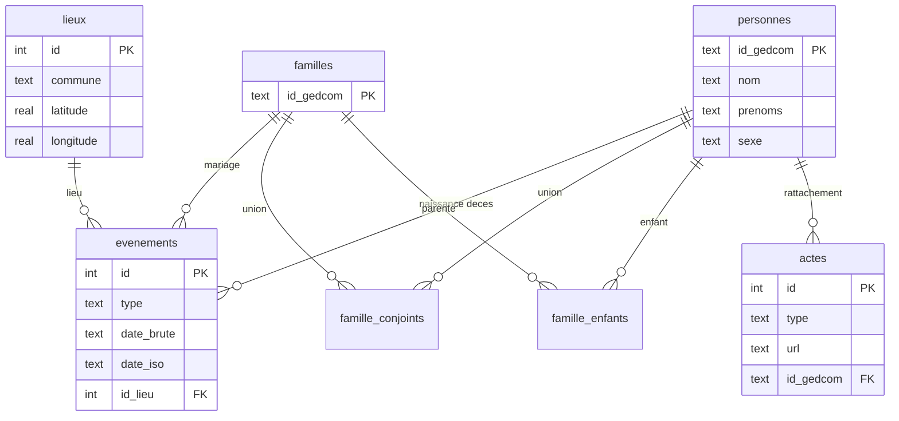

# Schéma SQLite — index généalogique

Document de référence pour le répertoire `bdd/`.  
La base est un **index dérivé** : recréée ou reconstruite à chaque import GEDCOM + indexation actes.  
**Source de vérité** : GEDCOM ([`ged/fminier.ged`](https://github.com/minier-francois-genealogie/data/blob/main/ged/fminier.ged)) + fichiers [`actes/`](https://github.com/minier-francois-genealogie/data/tree/main/actes) sur GitHub. Dev local : clone sous `github/data/`.

**Scripts d'import :** voir [`bdd/scripts/README.md`](scripts/README.md).

**Version schéma actuelle :** `3` (table `photos`, type `P` dans `actes/`).

---

## Principes

| Principe | Détail |
|----------|--------|
| **Lecture seule côté app** | Aucune édition manuelle de SQLite ; corrections dans Heredis → réexport GEDCOM → re-import |
| **UTF-8** | Noms, prénoms, communes affichés avec accents (contrairement aux chemins `actes/` en ASCII) |
| **Id GEDCOM** | Clé technique courante (`@655@`) ; peut changer si réexport → re-calcul du rattachement actes via **clé sémantique** |
| **Navigation arbre** | Par **`id_gedcom`** et tables de parenté — pas de numérotation SOSA en base |
| **Actes** | Métadonnées + URL GitHub ; **pas** de binaire en base ni sur le serveur |
| **Lieux** | Table dédiée + cache géocodage (latitude / longitude) |
| **Nommage** | Tables et colonnes en **français** (`snake_case`) ; codes GEDCOM (`NAISSANCE`, `DECES`, `MARIAGE`) ou fichiers actes (`N`, `M`, `D`) conservés là où c'est la convention métier |

---

## Vue d'ensemble (ER)



---

## Fichier et métadonnées d'import

### `meta`

Paramètres persistants (une ligne, `id = 1`).

| Colonne | Type | Description |
|---------|------|-------------|
| `id` | INTEGER PK | Toujours `1` |
| `version_schema` | INTEGER NOT NULL | Version du schéma (migrations) |
| `id_gedcom_racine` | TEXT NOT NULL | Id GEDCOM de la **personne par défaut** à l'ouverture (souche, ex. François Xavier MINIER) |
| `chemin_gedcom` | TEXT | Chemin du fichier importé |
| `empreinte_gedcom` | TEXT | SHA-256 du GEDCOM (détection changement) |
| `empreinte_actes` | TEXT | Empreinte du listing actes (arborescence / git tree) |
| `importe_le` | TEXT NOT NULL | ISO 8601 UTC |
| `nb_personnes` | INTEGER | Nombre de personnes |
| `nb_familles` | INTEGER | Nombre de familles |
| `nb_actes` | INTEGER | Nombre de fichiers actes indexés (N/M/D) |
| `nb_photos` | INTEGER | Nombre de fichiers photos indexés (type P) |

---

## Personnes

### `personnes`

Une ligne par individu GEDCOM (`0 @…@ INDI`).

| Colonne | Type | Contraintes | Description |
|---------|------|-------------|-------------|
| `id_gedcom` | TEXT | PK | Ex. `@655@` |
| `nom` | TEXT NOT NULL | | Nom de famille (UTF-8) |
| `prenoms` | TEXT | | Prénoms complets (UTF-8) |
| `sexe` | TEXT | CHECK IN (`M`,`F`,`U`) | Sexe |
| `profession` | TEXT | | Profession GEDCOM (`OCCU`), ex. « Cultivateur » |
| `id_famille_enfant` | TEXT | FK → `familles.id_gedcom` | Famille où l'individu est enfant (GEDCOM `FAMC`) |
| `nom_tri` | TEXT | | `{nom}/{prenoms}` pour tri et recherche |
| `texte_recherche` | TEXT | | Chaîne normalisée (nom, prénoms, profession — sans accent) pour recherche |

**Index :** `idx_personnes_nom`, `idx_personnes_texte_recherche`, `idx_personnes_profession`.

### Navigation arbre (sans table SOSA)

L'arbre se parcourt via le graphe GEDCOM :

| Besoin | Requête |
|--------|---------|
| Personne courante | `personnes` par `id_gedcom` |
| Parents | `id_famille_enfant` → `famille_conjoints` |
| Enfants | `personne_unions` → `famille_enfants` |
| Frères/sœurs | même `id_famille_enfant`, autres lignes `famille_enfants` |
| Conjoints | `personne_unions` → `famille_conjoints` (autre conjoint) |
| Ancêtres sur *n* générations | remontée récursive via parents |
| Descendants sur *m* générations | descente récursive via enfants |

Le **SOSA** (ahnentafel) reste utile dans les **scripts de contrôle** (`generate_ascendance_table.py`) mais n'est **pas stocké** en SQLite.

---

## Familles et parenté

### `familles`

Une ligne par enregistrement GEDCOM `0 @…@ FAM`.

| Colonne | Type | Contraintes | Description |
|---------|------|-------------|-------------|
| `id_gedcom` | TEXT | PK | Ex. `@9246@` |

### `famille_conjoints`

Conjoints d'une union (0, 1 ou 2 — GEDCOM incomplet possible).

| Colonne | Type | Contraintes | Description |
|---------|------|-------------|-------------|
| `id_famille` | TEXT | PK¹, FK → `familles` | |
| `id_personne` | TEXT | PK¹, FK → `personnes` | |
| `role` | TEXT | CHECK IN (`epoux`,`epouse`) | Rôle dans la famille |

¹ Clé primaire composite `(id_famille, id_personne)`.

### `famille_enfants`

Liens parent → enfant via la famille.

| Colonne | Type | Contraintes | Description |
|---------|------|-------------|-------------|
| `id_famille` | TEXT | PK¹, FK → `familles` | |
| `id_enfant` | TEXT | PK¹, FK → `personnes` | |
| `ordre` | INTEGER | | Ordre CHIL dans le GEDCOM |

**Index :** `idx_famille_enfants_enfant` (`id_enfant`).

### `personne_unions`

Unions auxquelles une personne a participé (côté conjoint) — miroir pratique pour navigation conjoint.

| Colonne | Type | Contraintes | Description |
|---------|------|-------------|-------------|
| `id_personne` | TEXT | PK¹, FK → `personnes` | |
| `id_famille` | TEXT | PK¹, FK → `familles` | |

---

## Événements et lieux

### `lieux`

Lieux dédupliqués (une entrée par chaîne `PLAC` GEDCOM distincte, enrichie au géocodage).

| Colonne | Type | Contraintes | Description |
|---------|------|-------------|-------------|
| `id` | INTEGER | PK AUTOINCREMENT | |
| `libelle_brut` | TEXT NOT NULL UNIQUE | | Valeur brute GEDCOM ex. `Augan,56800,Morbihan,Bretagne,FRANCE` |
| `commune` | TEXT | | 1er segment — **ville seule** (sans arrondissement : `Paris 17e` → `Paris`) |
| `code_postal` | TEXT | | Code postal si présent |
| `departement` | TEXT | | Département (ex. `56`, `Morbihan`) |
| `region` | TEXT | | |
| `pays` | TEXT | | |
| `latitude` | REAL | | Latitude (cache géocodage) |
| `longitude` | REAL | | Longitude |
| `geocode_le` | TEXT | | ISO 8601 ou NULL si non géocodé |
| `statut_geocodage` | TEXT | | `ok` \| `echec` \| `en_attente` |

**Index :** `idx_lieux_commune`, `idx_lieux_departement`.

### `evenements`

Naissances, décès (individu) et mariages (famille).

| Colonne | Type | Contraintes | Description |
|---------|------|-------------|-------------|
| `id` | INTEGER | PK AUTOINCREMENT | |
| `type` | TEXT | NOT NULL, CHECK IN (`NAISSANCE`,`DECES`,`MARIAGE`) | |
| `id_personne` | TEXT | FK → `personnes`, NULL | Renseigné pour `NAISSANCE`, `DECES` |
| `id_famille` | TEXT | FK → `familles`, NULL | Renseigné pour `MARIAGE` |
| `id_lieu` | INTEGER | FK → `lieux`, NULL | |
| `date_brute` | TEXT | | Date GEDCOM verbatim ex. `3 NOV 1981` |
| `date_iso` | TEXT | | Normalisée `YYYY-MM-DD` (partielle `YYYY` ou `YYYY-MM` si besoin) |
| `date_tri` | TEXT | | Clé de tri stable (ISO paddée) |

**Contraintes logiques (application) :**

- `NAISSANCE` / `DECES` : `id_personne` NOT NULL, `id_famille` NULL
- `MARIAGE` : `id_famille` NOT NULL, `id_personne` NULL (les conjoints viennent de `famille_conjoints`)

**Index :** `idx_evenements_personne_type` (`id_personne`, `type`), `idx_evenements_famille` (`id_famille`).

---

## Actes scannés

### `actes`

Un fichier scan indexé sous `actes/` (jpg, pdf, png…).

| Colonne | Type | Contraintes | Description |
|---------|------|-------------|-------------|
| `id` | INTEGER | PK AUTOINCREMENT | |
| `type` | TEXT | NOT NULL, CHECK IN (`N`,`M`,`D`) | Naissance / Mariage / Décès |
| `cle_personne` | TEXT NOT NULL | | Clé sémantique dossier ex. `BELLAMY__Joseph_Marie__1805-06-10__56__Guer` |
| `chemin_dossier` | TEXT NOT NULL | | Chemin relatif du dossier personne |
| `nom_fichier` | TEXT NOT NULL | | Nom du fichier |
| `chemin_relatif` | TEXT NOT NULL UNIQUE | | Chemin relatif depuis `actes/` |
| `url` | TEXT NOT NULL | | URL publique (`ACTES_BASE_URL` + `chemin_relatif`) |
| `date_acte_iso` | TEXT | | Date dans le nom de fichier |
| `departement` | TEXT | | Département acte |
| `commune` | TEXT | | Commune acte (UTF-8 pour affichage) |
| `suffixe` | TEXT | | Ex. `A_VERIFIER`, `COMMUNE` |
| `taille_fichier` | INTEGER | | Octets (0 = placeholder — ignoré) |
| `id_gedcom` | TEXT | FK → `personnes`, NULL | Personne rattachée après matching |
| `methode_raccord` | TEXT | | `cle_naissance` \| `date_evenement` \| NULL |
| `score_raccord` | INTEGER | | Confiance du rattachement (optionnel) |

**Index :** `idx_actes_id_gedcom`, `idx_actes_cle_personne`, `idx_actes_type` (`id_gedcom`, `type`).

### Rattachement acte → personne (import)

1. Parser le **dossier personne** (`cle_personne`) et le fichier (`N` / `M` / `D`).
2. **Acte N** : recoupement naissance GEDCOM (nom, prénoms, date, dept, commune normalisés ASCII).
3. **Acte M** : date/lieu mariage + identité du fichier (un fichier par conjoint).
4. **Acte D** : date/lieu décès + identité.
5. Les fichiers actes **ne changent pas** si les `@I…@` GEDCOM changent ; seul `actes.id_gedcom` est recalculé.

### `photos`

Photos de l'individu indexées sous `actes/` (fichiers type **`P`**, voir `SPECIFICATION.md`).

| Colonne | Type | Contraintes | Description |
|---------|------|-------------|-------------|
| `id` | INTEGER | PK AUTOINCREMENT | |
| `cle_personne` | TEXT NOT NULL | | Clé sémantique du dossier personne |
| `chemin_dossier` | TEXT NOT NULL | | Chemin relatif du dossier personne |
| `nom_fichier` | TEXT NOT NULL | | Nom du fichier |
| `chemin_relatif` | TEXT NOT NULL UNIQUE | | Chemin relatif depuis `actes/` |
| `url` | TEXT NOT NULL | | URL publique GitHub |
| `suffixe` | TEXT | | Suffixe libre (`Photo_01`, `Portrait`…) — tri alphabétique à l'affichage |
| `taille_fichier` | INTEGER | | Octets |
| `id_gedcom` | TEXT | FK → `personnes`, NULL | Personne rattachée (matching naissance, comme acte N) |

**Index :** `idx_photos_id_gedcom`, `idx_photos_cle_personne`.

**Ordre API / IHM :** `ORDER BY suffixe, nom_fichier` (alphabétique).

---

## Stratégie d'import

```text
1. Lire GEDCOM → personnes, familles, famille_conjoints, famille_enfants, evenements, lieux
2. Lister actes/ via API GitHub → actes N/M/D + photos P (+ URLs raw.githubusercontent.com)
3. Matcher actes.id_gedcom et photos.id_gedcom
4. Mettre à jour meta (empreintes, compteurs, importe_le)
```

**Scripts :** `bdd/scripts/import_gedcom.py`, `import_actes.py`, `import_all.py` — voir `bdd/scripts/README.md`.

**Re-import / Rafraîchir :** si empreinte inchangée → skip ; sinon reconstruction complète.

**Fichier SQLite proposé :** `bdd/genealogie.sqlite` (gitignored ; généré localement).  
**Script de création :** `bdd/schema.sql`.  
**Import GEDCOM :** `python bdd/scripts/import_gedcom.py` — voir `bdd/scripts/README.md`.

---

## Correspondance spec ↔ tables

| Besoin spec | Table(s) |
|-------------|----------|
| Fiche individu | `personnes`, `evenements`, `lieux` |
| Navigation arbre | `personnes`, `famille_enfants`, `famille_conjoints`, `personne_unions` |
| Clic conjoint | `personne_unions`, `famille_conjoints`, `evenements` (`MARIAGE`) |
| Icônes N / M / D | `actes` |
| Galerie photos | `photos` (tri alphabétique sur `suffixe`) |
| Modal scan | `actes.url` |
| Recherche | `personnes.texte_recherche` (nom, prénoms, profession) |
| Carte Leaflet | `lieux.latitude`, `lieux.longitude` |
| Rafraîchir | `meta.empreinte_gedcom`, `meta.empreinte_actes` |

---

## Références code existant

| Sujet | Fichier |
|-------|---------|
| Parsing GEDCOM / parenté | `scripts/analyze_ascendance.py` |
| Dates GEDCOM → ISO | `scripts/gedcom_dates.py` |
| Normalisation chemins actes | `scripts/act_path_normalize.py` |
| Convention actes v2 | `SPECIFICATION.md` |
| Tableau ascendance SOSA (hors BDD) | `scripts/generate_ascendance_table.py` |
